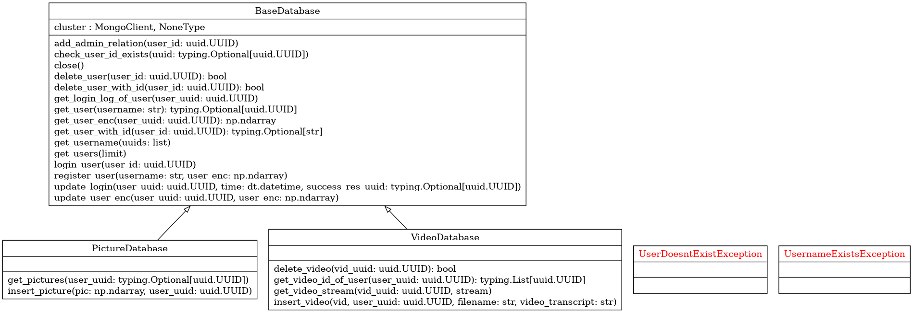
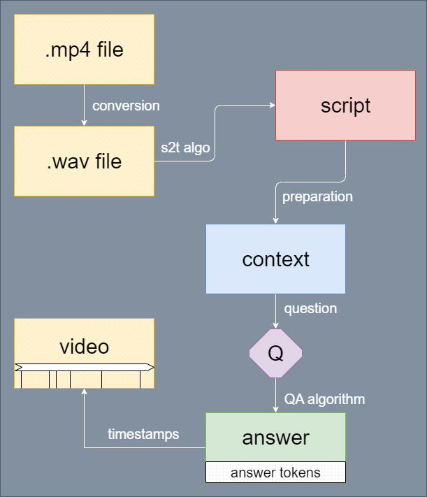

# SoSe 23 Big Brother - Projektdokumentation

## Einleitung und Zielsetzung
Dieses Projekt wurde im Rahmen des Programmierpraktikums 
"moderne verteilte Anwendungen" absolviert. Ziel war es die Funktionalitäten
der webbasierten Anwendung vom "big brother 2021" zu erweitern. Unser Ziel
war es:
- weitere Zulassungskontrollalgorithmen
- Gestenerkennung 
- Lehrvideoanalyse
zu implementieren. Wir haben außerdem vor gehabt die Datenbank des vergangenen
Jahres noch flexibler mit MongoDB zu gestalten.

## Gruppenaufteilung
Um diese Ziele zu erreichen haben wir uns in Untergruppen aufgeteilt:
- Datenbank: Regelt implementation der Datenbank.
- Logik: Implementiert weitere Algorithmen, welche in unseren Zielen stehen.
Aufgrund der Komplexität dieser Aufgabe haben wir diese nochmals in 
Untergruppen unterteilt:
    - FnG (engl. face and gesture): Diese Gruppe implementiert die Gesichts und
    Gestenerkennung.
    - eduVid (engl. educational videos): Diese Gruppe implementiert das 
    analysieren von Lehrvideos
- Frontend: Diese Gruppe regelt die Webanwendung.

Um die Kommunikation und Zusammenarbeit in den Gruppen nicht zu kompliziert 
schwierig machen, haben wir uns dazu entschieden, dass jede Untergruppe einen
verantwortliches Mitglied hat, welches dafür sort, dass die Schnittstellen,
welche von den anderen Nutzer genutzt werden klar definiert sind. Dies soll
mit Tests und Maßstäben (engl. benchmarks) sichergestellt werden. Die Tests
sind vorallem wichtig, damit zukünftig an diesem Projekt arbeitende Gruppen
unseren Code besser verstehen können und Schwierigkeiten beim Debuggen
neu strukturieren können. Zusammengefasst haben Tests das Ziel
- den Code besser zu erklären,
- Workflows zu verdeutlichen,
- debugging zu vereinfachen und
- innere Logik von Funktionen und Methoden abändern zu können, ohne Angst 
haben zu müssen die Schnittstellen unbewusst kaputt zu machen.

## Datenbank
Wie in der Einleitung bereits erwähnt, haben wir uns dazu entschieden die
Datenbank in MongoDB zu implementieren. Dies ist eine NoSQL-Datenbank,
welche nicht so strikt strukturiert werden muss, wie SQL. Hierbei werden die
Inhalte in der Datenbank nicht normalisert, sondern so Erstellt, dass die
Anfragen an die Datenbank schneller bearbeitet werden kann. Bei herkömmlichen
Datenbanken nimmt man in der Regel nicht viel Rücksicht auf die 
spezifischen/oft vorkommenden Anfragen der Datenbank beim Erstellen dessen,
weshalb Anfragen viele Tabellen mit Joins verknüpfen müssen, welche unnötigen
overhead verursachen könnten. Da wir das Projekt in Zukunft oft mit neuen
Ideen erweitern wollen, wollte die Datenbank auf flexibler sein.

Hierzu haben wir ein zunächst ein Datenbankschema entwickelt. Hierbei nutzen wir
eine Notation, welche ähnlich zu der ER-Model-Notation ist, um
die Struktur leichter verständlich zu machen:


Die Entitäten in diesem Modell sind *Collections* in MongoDB, wobei deren
Inhalt *Documents* sind. Wir erklären die Entitäten, einige Beziehungen
zueinenander und unsere Designentscheidungen im Folgenden kurz:
- `resource`: Dies ist im eine Resource in unserem System. Wir nutzen dies,
um beispielsweise Bilder zu speichern.
- `resource_context`: Dies ermöglicht uns die IDs von den verschiedenen 
Resourcen zu gruppieren. Man kann sich das so ähnlich vorstellen, wie eine
Ordnerstruktur in einem Betriebssystem. Diese könnte auch genutzt werden, um
eine hierarchische Ordnerstruktur zu erstellen. In unserem Projekt nutzen wir
dies lediglich, um Resourcen zu gruppieren.
- `login_attempt`: Hier werden die Anmeldeversuche der Nutzer gespeichert.
Falls diese nicht erfolgreich sind, d.h. das Gesichtserkennungsbild
(also Passwort) wurde nicht erkannt, so ist der Eintrag `login_suc` auf *falsch*
gesetzt. Falls die Anmeldung erfolgreich war, wo ist `login_succ` auf *wahr*
gesetzt, wobei die ID der Resource, die zum erfolgreichen Anmelden geführt hat
in dem Feld `success_res_id` abgespeichert wird. Diese kann später abgerufen 
werden. Die `success_res_type` beschreibt den Typ der Ressource, welche zum
Erfolgreichen anmelden geführt hat. Wir nutzen in unserem System nur einen
Typ, jedoch kann man in Zukunft auch Resourcen, wie ein Video stream oder 
ähnlichen nutzen.
- `user`: Speichert wichtige Nutzerdaten. Hierbei werden sogenannte "encodings"
für jeden Nutzer abgespeichert. Diese enthalten Daten des Gesichts des Nutzers
und werden für den Gesichtserkennungsalgorithmus benötigt. Da diese Daten so
groß sind und man diese nicht jedes mal von der Datenbank in den Hauptspeicher
laden möchte, wenn man nur den Benutzernamen einer `_id` abfragen möchte,
was in unserer Anwendung recht häufig passiert, speichern wir nur ab, wo man
das Encoding bei den Resourcen finden kann.

Das Implemplementieren geschah in der ersten und zweiten Phase des Projekts
wie geplant. Hierbei mussten wir besonders darauf achten, dass wir die
Schnittstellen der alten Datenbank beibehalten. Durch unsere Implementierung
und kleine Seiteneffekte ist in dieser Phase des Projektes einiges an Code
am Frontend kaputt gegangen. Daraufhin haben wir mehr tests entwickelt, um
die unsere Schnittstellen besser für die Anwendungsfälle der anderen Gruppen
zu Testen. Hierbei hat es bei uns besonders geholfen, wenn eine Person
zuerst die Tests und Beschreibung (in Python den *Docstring*) für zu 
implementierenden Funktionalitäten geschrieben hat und eine andere Person 
die Funktionalitäten implementiert hat.

In der dritten Phase des Projektes haben wir versucht zu überlegen, was 
passieren könnte, wenn wir Nebenläufige Zugriffe auf die Datenbank haben.
Da MongoDB automatisch die Daten, auf die Zugegriffen werden blockiert,
mussten wir hierbei nicht sehr viel machen. In dieser Phase haben wir
außerdem einige Funktionalitäten für andere Gruppen implementiert, falls diese
etwas in der Datenbank ablegen mussten.

Am Anfang des Projektes viel es etwas schwer den anderen Gruppen zu zeigen,
wie unsere Schnittstellen genutzt werden sollten. Hierzu haben wir zunächst
eine automatische Dokumentation aus dem *Docstring* erstellt. Diese hab jedoch
nicht wirklich gezeigt, wie die Methoden miteinander genutzt werden sollen.
Dies haben wir gelöst, indem wir neben der Dokumentation auch noch Beispielcode
den anderen Gruppen gegeben wurde. Diesen Beispielcode haben wir in unseren
Tests implementiert, damit in Zukunft durch die automatischen Tests die
Korrektheit (zumindest teilweise) bestätigt werden kann.

Die Struktur der Datenbank ist in dem unteren UML-Diagramm ersichtlich:

Die Komponenten mit ihrer Bedeutung wird nun kurz erläutert:
- Exceptions: Wir haben zwei *exceptions* eingeführt, um Fehler besser 
beschreiben zu können.
- `BaseDatabase`: Hier sind die wesentlichen Funktionen für die 
Benutzerverwaltung implementiert. Diese Klasse fungiert als fundament der
anderen zwei Klassen, die in den folgenden Stichpunkten erkläutert werden.
- `PictureDatabase`: Diese Klasse stellt die Funktionaliät bereit Bilder
in der Datenbank zu speichern und aufzurufen.
- `VideoDatabase`: Diese Klasse stellt die Funktionaliät bereit Videos
in der Datenbank zu speichern und aufzurufen. Intern wird ein anderer
Mechanismus genutzt als beim abspeichern der Bilder, da Bilder generell 
deutlich weniger Speicherplatz benötigen als Videos.

## Logik
Für die Umsetzung der Gesichtserkennung wurde das python package "face-recognition"
benutzt.

Das Python-Paket "face-recognition" ist eine Open-Source-Bibliothek, 
die auf der Grundlage von OpenCV entwickelt wurde 
und auf der Gesichtserkennungstechnologie von dlib basiert. 
Sie ermöglicht die Erkennung und Analyse von Gesichtern in Bildern und Videos.

Die Gesichtserkennungstechnologie von dlib basiert auf dem 2017 veröffentlichten 
"Histogram of Oriented Gradients for Human Detection" (HOG)-Feature-Extractor 
und dem "Linear Support Vector Machines" (SVM)-Klassifikator. 
Diese Methode wurde von Navneet Dalal und Bill Triggs in ihrer Veröffentlichung
"Histograms of Oriented Gradients for Human Detection" vorgestellt.

Die dlib-Bibliothek verwendet eine Kombination aus HOG-Features und SVM-Klassifikation, 
um Gesichter in Bildern zu erkennen. Der HOG-Algorithmus basiert auf der Idee, 
dass das Erscheinungsbild eines Objekts durch die Verteilung von Gradienten 
oder Kanteninformationen beschrieben werden kann. Es werden Histogramme der 
Gradientenrichtungen erstellt und diese Histogramme dienen als Features für den Klassifikator.

Der SVM-Klassifikator wird trainiert, um zwischen Gesichts- 
und Nicht-Gesichtsregionen zu unterscheiden. Dafür werden positive Beispiele 
von Gesichtern und negative Beispiele von Nicht-Gesichtern verwendet. 
Der SVM-Klassifikator lernt dann, diese beiden Klassen zu unterscheiden 
und kann anschließend auf neue Bilder angewendet werden, um Gesichter zu erkennen.

Die dlib-Bibliothek stellt auch eine vortrainierte Gesichtserkennungsmodell-Datei bereit, 
die mit dem HOG-Feature-Extractor und dem SVM-Klassifikator trainiert wurde. 
Dieses Modell wird verwendet, um Gesichter zu erkennen 
und kann mit der Funktion `dlib.get_frontal_face_detector()` abgerufen werden.

## eduVid (engl. educational videos):

**Projektziele und ihre Erreichung**

We achieved the goal using the s2t library - `faster-whisper`. As for extractive question answering, we used the pretrained model from hugging face `mdeberta-v3-base-squad2`. For video editing we used `MoviePy` library.

**Description of the effects achieved**
:the user uploads a video (e.g. with a presentation) in .mp4 format. The program converts the file to a .wav format. Next, speech recognition is performed to obtain a transcription from the uploaded video. Then, the transcription is properly prepared (the processes have been described) to obtain the context, on the basis of which answers to the questions asked by the user are found. Additionally for the given answer, timestamps are returned. They indicate to a moment in video where displayed aswer is included.




**Auftretene Schwierigkeiten**
- Speech recognition: Answers to the asked questions are searched in the so-called context, which is generated using a speech recognition algorithm. This is, so to speak, the first stage, on the basis of which later activities are carried out. Unfortunately, every algorithm has its weaknesses (such as recognizing words incorrectly) which in this case affect the correct operation of the program. During the work we came up with a couple of solutions that we did not manage to implement, but which may be useful (description in the next section)
	- in addition, of all the program's operation, the longest process is text transcription, 	any form of optimization of execution time (while maintaining the accuracy of 	speech recognition) would be useful.
- Answers are rarely well formulated sentences which could make asking for definitions of words difficult: The current algorithm gives the answer in a very concise way - these are actually snippets from the generated context. This form of answer is not always fully comprehensive and clear. It would be useful to present the answers in the form of well-structured sentences that go a little beyond the information given in context.
- Algorithm has difficulties with recognizing grammar of given question. In some cases, it could be important to recognize the grammar in the question being asked. For instance the tenses, since the answers given to them without taking them into consideration may be wrong/not entirely true.


**Empfehlungen fuer weiteres Vorgehen (also Ideas)**
- Speech rocognition: A nice touch would be adding some benchmarks. In addition to this, it would be important to replace misrecognized words with those that are most likely. Also a base of words specified for specific subjects (for example, a user can choose the type of category his video belongs to, and a predefined word base is used based on that), would come in handy.
- Identify segments in audio and group them together or index them with keywords so that you can access relevant segments by demand: In our case, if the question asked is a keyword the algorithm will not be able to answer correctly. The expected answer would be well-formed sentences related to the given keyword. (This kind of solution is an idea for further work)
- Slide extraction: We worked also on considering the content of the presentation (from the uploaded video) for context but did not complete it. The main idea was to recognize the change/transition of slides so that we could extract images with individual slides. OCR of the content contained in the photos was then performed. Interacting the audio track with the image for this task is taking it a step further and continuing with this idea seems to be the right thing to do. The codes we were able to write that we ultimately did not use can be found in "big-brother/src/eduVid /handle_presentation(unused)"
- Take recordings autoregressively guess what is said afterwards.
- Remember topic changes from sound and image. Also, we wanted the interactive video produced by the program to show changes in the topics discussed. The process of recognizing topics and changing them was evpected to happen automatically (insted of predefining it by user).
  
## Frontend

**Webanwendung**
Um die Webanwendung mit Python zu programmieren haben wir beschlossen das Webframework Flask zu nutzen. Flask ist möglichst einfach gehalten und besitzt im Vergleich zu anderen Webframeworks keine unnötigen Funktionen. Von anderen Bibliotheken abgedeckte Funktionen, werden nicht in Flask umgesetzt und lassen sich über die bestehenden Bibliotheken integrieren.

**Milestone 1**
Als ersten Meilenstein haben wir uns gesetzt den Code vom Team21 zu analysieren und zu verstehen, sowie die Website zu überarbeiten. Um die Website zu überarbeiten, musste jedoch der Zugriff auf die Website hergestellt werden. Dafür wurden sämtliche Requirements mit den dafür vorgesehenen Versionen heruntergeladen. Dabei muss man auf die richtige Python Version (Python 3.10.2) achten, damit alle Requirements heruntergeladen werden können. Des Weiteren ist aufgefallen, dass es obsolete Requirements gibt, die entfernt wurden. Dies war ein kleines Hindernis, da einige Probleme mit der Umstellung ihrer Python Versionen hatten. Anschließend wurde der Vorgang in der „ReadMe“ Datei dokumentiert. Um die Website zu bearbeiten, mussten erst die Bugs gefixt werden. So gab es Probleme bei den Routes, Einige Funktionen funktionierten nicht und die Verbindung zum Backend musste hergestellt werden.

**Milestone 2**
Daraus resultierten unsere nächsten Herausforderungen für den 2. Milestone. Die Aufgaben wurden innerhalb der Gruppe aufgeteilt. So wurden fehlende Routes, wie „sign up with photo“ und „sign in with photo“, hinzugefügt und getestet. Zusammen mit dem Backend und Logik Team wurden die Bugs gefixt. So wurden beispielsweise einige Variablen falsch übernommen. Wir haben bewusst mit den anderen Teams die Bugs gefixt, da die zu implementierenden Inhalte in ihren Themenfeldern waren, und sie dementsprechend schnell die gefundenen Fehler beheben konnten. Des Weiteren haben wir uns für ein neues Design der Website entschieden, um die Seite visuell attraktiver für den User zu gestalten. Während dieser Phase gab es Schnittstellen Probleme zur Registrierung und Anmeldung mit der Gesichtserkennung („FaceRecognition“).

**Milestone 3**
So haben wir beschlossen in der Dritten Phase die Probleme bezüglich der Gesichtserkennung zu beheben. Bei der Anmeldung mit Kamera gab es nun einen Countdown und nach Ablauf des Countdowns wird ein Bild gemacht, welcher automatisch gedownloaded wird. Hinzu musste ebenfalls der GPU-Server auf Coolify konfiguriert werden, weswegen die Implementierung der „EduVid“ Logik in den Hintergrund rückte. 
Somit wurde für EduVid vorerst eine triviale Version implementiert, in der man lediglich ein Video mit einem Titel hochladen kann. Zusätzlich wurden Videounabhängige Time-Stamp Buttons erstellt, mit welchen man an bestimmte Stellen im Video springen kann. 
Das Team hatte anfangs Probleme mit dem Konfigurieren des Servers, weswegen wir uns gemeinsam der Aufgabe gewidmet haben. Um den Server zu deployen haben wir angefangen einen Dockerfile zu erstellen. Dieser wurde nicht ganz fertig bis zum präsentieren des 3. Milestones. Währenddessen hatten wir die Idee unser gesamtes Team SoSe2023 zu verewigen, wie es das SoSe2021 vor uns gemacht hat.

**Probleme und Problembehandlung**
Nach dem 3. Milestone und nach dem die EduVid Logik fertig war, wurde die 2. Ausbaustufe von EduVid implementiert.
Der Docker Container der angefangen wurde im 3. Milestone wurde fertig gestellt und die FaceRecognition ebenfalls. Das Vergleichen des live Images mit den Bildern aus der Registrierung, welche im Backend gespeichert wird, war ein Erfolg. Die Idee in diesem Vorgang das Bild sichtbar für den User zu downloaden, wurde nicht übernommen.
Zusätzlich zum Video upload muss nun eine json Datei, welche passende Time-Stamps für das Video enthält, und ein Frage zu dem Video angegeben werden.
Nach Upload werden passende Antworten gefunden und 1 oder mehere Time-Stamps zu diesen erstellt. Auf der neuen Seite stehen die Time-Stamps aus der json Datei so wie die aus der Logik Funktion erstellten Time-stamps zur verfügung, wie auch eine Antwort auf die gestellte Frage.
Die json Datei muss einen Eintrag "time-stamps" enthalten, welcher Objekte der Form `{ "label": <time in seconds> }` enthalten muss.
#### Beispiel einer Time-Stamps JSON Datei:
```
{
	"time-stamps": [
		{"Intro": 0.0},
		{"Core Idea": 10.0},
		{"Next Steps": 30.0},
		{"Advanced": 300.0},
		{"Conclusion": 500.0},
		{"Outro": 700.0}
	]
}
```

#### Anmerkung zu EduVid:
Beim verlassen der Seite läuft im Backend die logik zur Video verarbeitung weiter, hier könnte man in einer weiteren Ausbaustufe mittels einer socket connection überprüfen, ob man sich noch auf der Seite befindet (auf das Video ergebnis wartet) und ggf. die Verarbeitung frühzeitig abbrechen.
Ähnlich wird dies bereits bei der Gestenerkennung umgesetzt.
