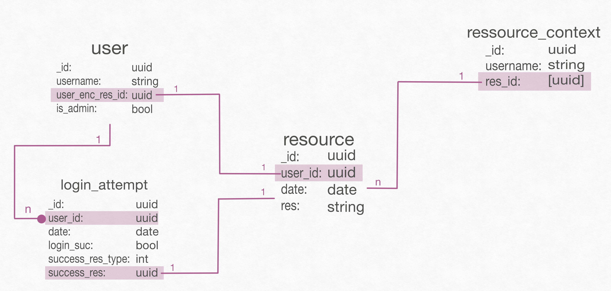

# Introduction to our database
We used the python language to implement our database. We primarily use 
mongodb to implement a database without the classical relational model. We
decided to do this, because of its flexibility. This means that we can design
our database in a way that makes it easier for our database queries, amongs
other things. If you are not familiar with mongodb please take a look at the
resources in [here](#mongodb_resources).

## Database schema
The schema looks as follows:

Here are some design decisions that lead to this schema:
- We implemented a `ressource_context` collection, because we 
wanted to group ressources together without having to create a new
database every time we create a new group of resources 
(e.g. training images for face recognition, training videos for face 
recognition, ...).
- We created a lot of references going out from the `user`, because the 
implementation needs to load every user in order to check whether a certain
`username` or `_id` has already been taken. While doing this we don't want
to also load the resources.
- We also decided to use a `success_res_type` in the collection 
`login_attempt` to destinguish between video or picture login.

## Resources

### MongoDB Resources
- Getting Started:
    - Introduction into how it works: 
      https://www.mongodb.com/docs/manual/tutorial/getting-started/
    - Setting atlas up: https://www.mongodb.com/docs/atlas/getting-started/ 
    - Using database (as Video): https://www.youtube.com/watch?v=ofme2o29ngU
      -> Similar to first link
- With Python (and pymongo):
    - Introductory: https://www.youtube.com/watch?v=rE\_bJl2GAY8
    - Reading more about it: 
        - Very short tutorial: https://www.mongodb.com/docs/drivers/pymongo/
        - https://pymongo.readthedocs.io/en/stable/
          -> https://pymongo.readthedocs.io/en/stable/tutorial.html
- Handling very big files: MongoDB doesn't allow you to store files that
are larger than 16MB. In order to store them you would need GridFs. 
There are some useful resources:
    - Overview: https://www.youtube.com/watch?v=GDUbWNJLPnc
    - Documentation: https://www.mongodb.com/docs/manual/core/gridfs/
    - With pymongo: 
        - Introduction: https://pymongo.readthedocs.io/en/stable/examples/gridfs.html
        - Read more: https://pymongo.readthedocs.io/en/stable/api/gridfs/index.html#module-gridfs
- Design: 
    - https://www.youtube.com/watch?v=leNCfU5SYR8
    - Schema Design Patterns: https://www.mongodb.com/blog/post/building-with-patterns-a-summary
    - How not to design - Anti-patterns: https://www.youtube.com/watch?v=8CZs-0it9r4&list=PL4RCxklHWZ9uluV0YBxeuwpEa0FWdmCRy
